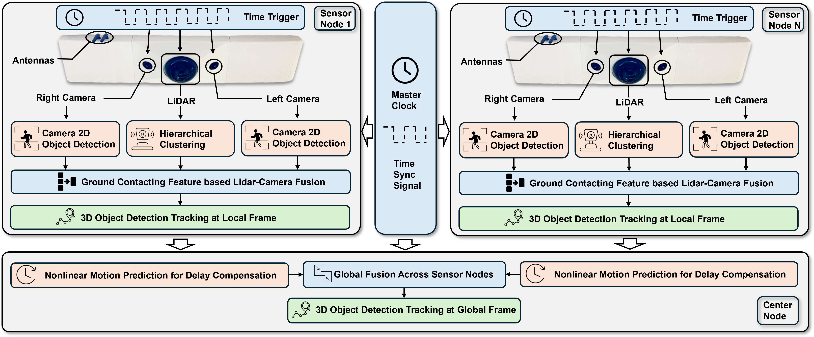

# MVSLab-IndoorCooperativePerception
Official Repo of ITSC2024: "Enhancing Indoor Mobility with Connected Sensor Nodes: A Real-Time, Delay-Aware Cooperative Perception Approach" Authored by, Minghao Ning, Yaodong Cui, Yufeng Yang, Shucheng Huang, Zhenan Liu, Ahmad Reza Alghooneh, Ehsan Hashemi and Amir Khajepour. 

For questions please contact Minghao Ning, minghao.ning@uwaterloo.ca.

### Overview of the project

This project is a part of the [MVSLab project](https://uwaterloo.ca/mechatronic-vehicle-systems-lab/research/5g-autonomous-outdoor-and-indoor-fleet-mobility/indoor-5g-autonomous-fleet-mobility), which aims to enhance indoor mobility with connected sensor nodes. The project is divided into two parts: local perception and global perception. The local perception is responsible for detecting and tracking objects in the local area of the sensor node. The global perception is responsible for fusing the local perception results from multiple sensor nodes to generate a global perception result. The proposed delay-aware cooperative perception framework is shown in the following figure.



An overview of the whole project can be found in the following video:
[](https://youtu.be/YsNX8Ubo7pk)

## Dataset
The dataset is stored in ROS bag format. The required camera parameters are saved in camera_info, sensor transformations are saved in tf, so you can easily visualize each dataset via Rviz. The dataset is available at [Google Drive](https://drive.google.com/drive/folders/1_2UOGiY8OORMtG4qc-np3rAN6A3O275M?usp=sharing).

The dataset is labeled with CVAT, the labels are oriented bounding boxes in the BEV (Bird's Eye View) format. An example is shown in:
[](https://youtu.be/UVUcsEo8Olw)

## Results
### Local Perception for varying density case
[](https://youtu.be/yXRH-UHOn6I)

### Local Perception for crowded case
[](https://youtu.be/bZyYKFu86tI)

### Global Perception for 3People1Bed
[](https://youtu.be/ESNUPyDQLdw)

### Global Perception for 9People
[](https://youtu.be/y_sCzz1o6HM)


## Citation
If you find this work useful, please consider citing:
```
@inproceedings{ning2024enhancing,
  title={Enhancing Indoor Mobility with Connected Sensor Nodes: A Real-Time, Delay-Aware Cooperative Perception Approach},
  author={Ning, Minghao and Cui, Yaodong and Yang, Yufeng and Huang, Shucheng and Liu, Zhenan and Alghooneh, Ahmad Reza and Hashemi, Ehsan and Khajepour, Amir},
  booktitle={2024 IEEE 27th International Conference on Intelligent Transportation Systems (ITSC)},
  year={2024},
  organization={IEEE}
}
```